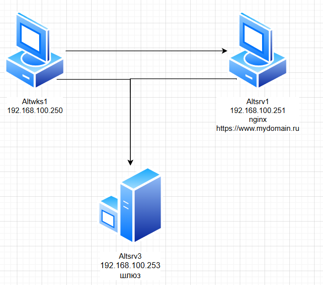

### Используемые ВМ
1. Клиентский узел - любая ВМ на выбор
2. Веб-сервер - любая ВМ на выбор
### Целевое состояние
* Функциональные требования
	* веб-сайт с адресом https://www.mydomain.ru
	* по меньшей мере с одной статической Web-страницей произвольного содержания
* Требования безопасности
	* web-сайт использует самоподписанный сертификат
	* параметры фильтрации трафика на веб-сервере разрешают подключения к серверу для получения доступа к веб-сайту, для управления сервером по протоколу SSH
	* параметры фильтрации трафика на веб-сервере разрешают исходящий трафик для обновления ПО сервера
	* параметры фильтрации трафика запрещают любые другие варианты взаимодействий кроме указанных
### Методика проверки
* Проверка подключений с клиентского узла или любого другого узла стенда
	* браузером по указанному в функциональных требованиях адресу - сайт должен открываться после внесения самоподписанного сертификата в список исключений
	* утилитой nmap к любому другому порту - порты протоколов, не указанных в требованиях безопасности не должны быть доступны
* Проверка возможности выполнить обновление ПО веб-сервера


### Altsrv1
```bash
apt-get install nginx
systemctl enable --now nginx
apt-get install webserver-common
mkdir /etc/nginx/ssl
cd /etc/nginx/ssl
openssl req -newkey rsa:4096 -nodes -keyout site.key -x509 -days 365 -out site.crt
...
Common Name (e.g., your name or your server's hostname) []:mydomain.ru
...
cd /etc/nginx/sites-available.d/
vim mydomain.conf
mkdir -p /var/www/vhosts/mydomain/{htdocs,logs}
echo "<html><body><h1><b>MYDOMAIN.RU<b></h1></body></html>" > /var/www/vhosts/mydomain/htdocs/index.html
cd /etc/nginx/sites-enabled.d/
ln -s ../sites-available.d/mydomain.conf ./
nginx -t
systemctl restart nginx
```
#### mydomain.conf
``` linenums="1"
server {
	listen 443 ssl;

	server_name mydomain.ru;
	ssl_certificate /etc/nginx/ssl/site.crt;
	ssl_certificate_key /etc/nginx/ssl/site.key;
	location / {
		root /var/www/vhosts/mydomain/htdocs;
	}
	access_log /var/www/vhosts/mydomain/logs/access.log;
	error_log /var/www/vhosts/mydomain/logs/error.log;
}
server {
	listen 80;
	server_name mydomain.ru;
	return 301 https://$server_name$request_uri;
}
```
#### iptables.sh
```bash linenums="1"
#!/bin/bash

# Разрешение loopback-интерфейса
iptables -A INPUT -i lo -j ACCEPT
iptables -A OUTPUT -o lo -j ACCEPT

# Разрешение DNS
iptables -A OUTPUT -p udp --dport 53 -m state --state NEW,ESTABLISHED -j ACCEPT
iptables -A OUTPUT -p tcp --dport 53 -m state --state NEW,ESTABLISHED -j ACCEPT
iptables -A INPUT -p udp --sport 53 -m state --state ESTABLISHED -j ACCEPT
iptables -A INPUT -p tcp --sport 53 -m state --state ESTABLISHED -j ACCEPT

# Разрешение HTTP (входящий)
iptables -A INPUT -p tcp --dport 80 -m state --state NEW,ESTABLISHED -j ACCEPT
iptables -A OUTPUT -p tcp --sport 80 -m state --state ESTABLISHED

# Разрешение HTTPS (входящий)
iptables -A INPUT -p tcp --dport 443 -m state --state NEW,ESTABLISHED -j ACCEPT
iptables -A OUTPUT -p tcp --sport 443 -m state --state ESTABLISHED -j ACCEPT

# Разрешение SSH (входящий)
iptables -A INPUT -p tcp --dport 22 -m state --state NEW,ESTABLISHED -j ACCEPT
iptables -A OUTPUT -p tcp --sport 22 -m state --state ESTABLISHED -j ACCEPT

# Разрешение обновления ПО (исходящий)
iptables -A OUTPUT -p tcp --dport 80 -m state --state NEW,ESTABLISHED -j ACCEPT
iptables -A INPUT -p tcp --sport 80 -m state --state ESTABLISHED -j ACCEPT
iptables -A OUTPUT -p tcp --dport 443 -m state --state NEW,ESTABLISHED -j ACCEPT
iptables -A INPUT -p tcp --sport 443 -m state --state ESTABLISHED -j ACCEPT

# Разрешение установленных и связанных соединений
iptables -A INPUT -m state --state ESTABLISHED,RELATED -j ACCEPT
iptables -A OUTPUT -m state --state ESTABLISHED,RELATED -j ACCEPT

# Политики по умолчанию
iptables -P INPUT DROP
iptables -P OUTPUT DROP
iptables -P FORWARD DROP
```

```bash
iptables-save > /etc/sysconfig/iptables
iptables-restore /etc/sysconfig/iptables
systemctl enable --now iptables
```
### Altwks1
```bash
echo "192.168.100.251 mydomain.ru www.mydomain.ru" >> /etc/hosts
```