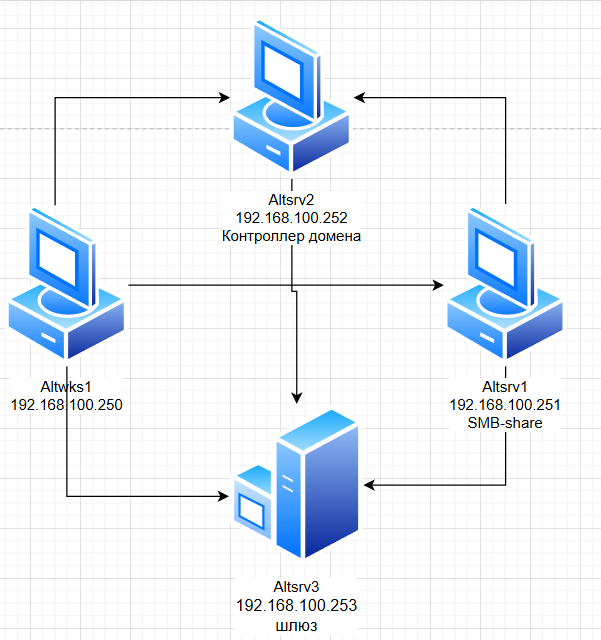
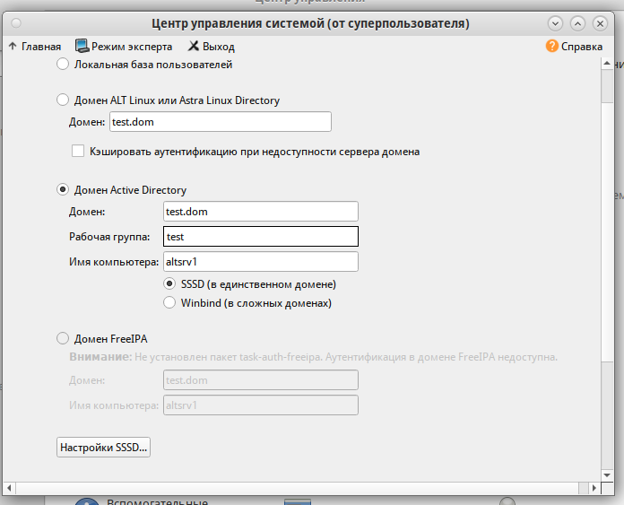

### Используемые ВМ
1. Клиентский узел - любая ВМ на выбор
2. Контроллер домена AD - любая ВМ на выбор
3. Сервер (SMB) в составе домена - любая ВМ на выбор
### Целевое состояние
* Функциональные требования
	* домен Active Directory с именем test.dom
	* в состав домена введены сервер и клиентский узел
	* с клиентского узла возможен вход в домен под доменными УЗ: sambauser1 - пароль ```Pa$$word```, sambauser2 - пароль ```Pa$$word```
* Требования безопасности
	* с клиентского узла в составе домена под доменными УЗ по протоколу SMB возможен доступ к разделяемому каталогу smbshare на сервере в составе домена
	* доступ к каталогу sambashare под пользователем sambauser1 возможен только на чтение
	* доступ к каталогу sambashare под пользователем sambauser2 возможен на чтение и запись
### Методика проверки
* Проверка входа в систему и подключений по протоколу SMB к разделяемому каталогу на сервере с клиентского узла под обоими доменными учетными записями
	* проверка возможности чтения файлов в разделяемом каталоге
	* проверка возможности записи в разделяемый каталог


### Altsrv2
#### /etc/hosts
```
192.168.100.250 altwks1 altwks1.test.dom
192.168.100.251 altsrv1 altsrv1.test.dom
192.168.100.252 altsrv2 altsrv2.test.dom
```

```bash
hostnamectl set-hostname altsrv2.test.dom
apt-get install alterator-fbi
systemctl enable --now alteratord ahttpd
apt-get install alterator-net-domain task-samba-dc
apt-get install alterator-datetime # (1)
systemctl restart alteratord ahttpd
systemctl stop smb nmb krb5kdc slapd bind dnsmasq
systemctl disable smb nmb krb5kdc slapd bind dnsmasq
rm -f /etc/samba/smb.conf
rm -rf /var/lib/samba
rm -rf /var/cache/samba
mkdir -p /var/lib/samba/sysvol
samba-tool domain provision --realm=test.dom --domain test --adminpass='Pa$$word' --dns-backend=SAMBA_INTERNAL --server-role=dc --use-rfc2307
systemctl enable --now samba
cp /var/lib/samba/private/krb5.conf /etc/krb5.conf
samba-tool user create sambauser1
samba-tool user create sambauser2
```

1. через web-gui, включить раздачу времени
#### /etc/net/ifaces/ens19/resolv.conf
```
search test.dom
nameserver 127.0.0.1
```

### Altsrv1
#### /etc/hosts
```
192.168.100.250 altwks1 altwks1.test.dom
192.168.100.251 altsrv1 altsrv1.test.dom
192.168.100.252 altsrv2 altsrv2.test.dom
```

```bash
hostnamectl set-hostname altsrv1.test.dom
vim /etc/net/ifaces/ens19/resolv.conf
reboot

# (1)
apt-get install task-auth-ad-sssd
```

1. ввод в домен


```bash
apt-get install samba
systemctl enable --now smb
systemctl enable --now avahi-daemon
mkdir /srv/smbshare
apt-get install acl
setfacl -m u:sambauser1:r-x /srv/smbshare
setfacl -m u:sambauser2:rwx /srv/smbshare
vim /etc/samba/smb.conf
systemctl restart smb
```
#### /etc/samba/smb.conf
```
...
[smbshare]
        path = /srv/smbshare
        read only = no
        valid users = sambauser1, sambauser2
        force create mode = 0660
        force directory mode = 0770
        inherit acls = yes
```

#### /etc/net/ifaces/ens19/resolv.conf
```
search test.dom
nameserver 192.168.100.252
```
### Altwks1
#### /etc/hosts
```
192.168.100.250 altwks1 altwks1.test.dom
192.168.100.251 altsrv1 altsrv1.test.dom
192.168.100.252 altsrv2 altsrv2.test.dom
```

```bash
hostnamectl set-hostname altwks1.test.dom
vim /etc/net/ifaces/ens19/resolv.conf
reboot

# (1)
apt-get install task-auth-ad-sssd
```

1. ввод в домен


#### /etc/net/ifaces/ens19/resolv.conf
```
search test.dom
nameserver 192.168.100.252
```