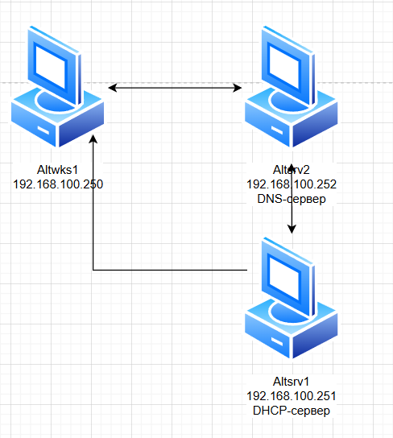
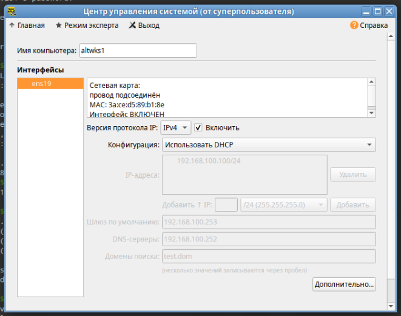

### Используемые ВМ
1. Клиентский узел - любая ВМ на выбор
2. Сервер DHCP - любая ВМ на выбор
3. Сервер DNS - любая другая ВМ на выбор
### Целевое состояние
* Функциональные требования
	* DNS-сервер с зоной test.dom с поддержкой динамических обновлений по ключу
	* зона обратного просмотра, соответствующая IP-сети стенда с поддержкой динамических обновлений по ключу
	* DHCP-сервер, выдающий адреса из диапазона IPv4-сети стенда (не менее 100 выдаваемых адресов) и отправляющий обновление прямой и обратной зоны
	* клиентский узел настроенный на динамическое получение IPv4-адреса и параметров стека протоколов
* Требования безопасности
	* обновление обеих зон DNS возможно только при предъявлении ключа
	* DHCP-сервер выдает адреса не пересекающиеся со статически заданными адресами узлов стенда
	* DNS-сервер обрабатывает рекурсивные запросы только с IP-адресов сети стенда
### Методика проверки
* Проверка подключений с клиентского узла или любого другого узла стенда
	* Нет возможности выполнить обновление зоны без предъявления правильного ключа
	* Узел настроенный на динамическое получение адреса, получает адрес из сети стенда, при этом создаются записи в прямых и обратных зонах DNS



### Altsrv2
```bash
apt-get install bind bind-utils
cd /var/lib/bind
mkdir zone/ddns
chown named:named zone/ddns
touch zone/ddns/test.dom.zone
chown named:named zone/ddns/test.dom.zone
vim chown named:named zone/ddns/test.dom.zone

tsig-keygen -a HMAC-SHA512 ddns-key > etc/ddns.key
vim etc/local.conf
named-checkconf -p
named-checkzone test.dom zone/ddns/test.dom.zone
cat etc/ddns.key # (1)
vim /var/lib/bind/etc/options.conf
```

1. скопировать и вставить на altsrv1
#### /var/lib/bind/zone/ddns/test.dom.zone
``` linenums="1"
$TTL 2h
@       IN      SOA     test.dom        root.test.dom. (
        2025032801
        12h
        2h
        2d
        2h )
        IN      NS      altsrv2
altsrv2 IN      A       192.168.100.252
```
#### etc/local.conf
``` linenums="1"
include "/etc/bind/rfc1912.conf";

// Consider adding the 1918 zones here,
// if they are not used in your organization.
//      include "/etc/bind/rfc1918.conf";

// Add other zones here
include "/etc/bind/ddns.key";
zone "test.dom" {
        type master;
        file "ddns/test.dom.zone";
        allow-update { key ddns-key; };
};
```
#### /var/lib/bind/etc/options.conf
``` linenums="1"
acl goodhosts {
	localnets;
	localhost;
	192.168.100.0/24;
	};
options {
	version "unknown";
	directory "/etc/bind/zone";
	dump-file "/var/run/named/named_dump.db";
	statistics-file "/var/run/named/named.stats";
	recursing-file "/var/run/named/named.recursing";
	secroots-file "/var/run/named/named.secroots";

	// disables the use of a PID file
	pid-file none;

	/*
	 * Oftenly used directives are listed below.
	 */

	listen-on { localhost; 192.168.100.252; };
	listen-on-v6 { ::1; };

	/*
	 * If the forward directive is set to "only", the server will only
	 * query the forwarders.
	 */
	forward only;
	forwarders { 77.88.8.8; };

	/*
	 * Specifies which hosts are allowed to ask ordinary questions.
	 */
	//allow-query { localnets; };

	/*
	 * This lets "allow-query" be used to specify the default zone access
	 * level rather than having to have every zone override the global
	 * value. "allow-query-cache" can be set at both the options and view
	 * levels.  If "allow-query-cache" is not set then "allow-recursion" is
	 * used if set, otherwise "allow-query" is used if set unless
	 * "recursion no;" is set in which case "none;" is used, otherwise the
	 * default (localhost; localnets;) is used.
	 */
	//allow-query-cache { localnets; };

	/*
	 * Specifies which hosts are allowed to make recursive queries
	 * through this server.  If not specified, the default is to allow
	 * recursive queries from all hosts.  Note that disallowing recursive
	 * queries for a host does not prevent the host from retrieving data
	 * that is already in the server's cache.
	 */
	allow-recursion { goodhosts; };

	/*
	 * Sets the maximum time for which the server will cache ordinary
	 * (positive) answers.  The default is one week (7 days).
	 */
	//max-cache-ttl 86400;

	/*
	 * The server will scan the network interface list every
	 * interface-interval minutes.  The default is 60 minutes.
	 * If set to 0, interface scanning will only occur when the
	 * configuration file is loaded.  After the scan, listeners will
	 * be started on any new interfaces (provided they are allowed by
	 * the listen-on configuration).  Listeners on interfaces that
	 * have gone away will be cleaned up.
	 */
	//interface-interval 0;
};

logging {
	// The default_debug channel has the special property that it only
	// produces output when the server’s debug level is non-zero. It
	// normally writes to a file called named.run in the server’s working
	// directory.

	// For security reasons, when the -u command-line option is used, the
	// named.run file is created only after named has changed to the new
	// UID, and any debug output generated while named is starting - and
	// still running as root - is discarded. To capture this output, run
	// the server with the -L option to specify a default logfile, or the
	// -g option to log to standard error which can be redirected to a
	// file.

	// channel default_debug {
	// 	file "/var/log/named/named.run" versions 10 size 20m;
	// 	print-time yes;
	// 	print-category yes;
	// 	print-severity yes;
	// 	severity dynamic;
	// };
};
```
### Altsrv1
```bash
apt-get install dhcp-server
cd /etc/dhcp/
cp dhcpd.conf.sample dhcpd.conf
vim ddns.key # (1)
vim dhcpd.conf
dhcpd -t
systemctl restart dhcpd
```

1. вставить скопированный ключ с altsrv2
#### /etc/dhcp/dhcpd.conf
``` linenums="1"
# See dhcpd.conf(5) for further configuration

ddns-updates on;
ddns-update-style interim;

include "/etc/dhcp/ddns.key";

zone test.dom {
	primary 192.168.100.252;
	key ddns-key;
}

zone 100.168.192.in-addr.arpa. {
	primary 192.168.100.252;
	key ddns-key;
}

subnet 192.168.100.0 netmask 255.255.255.0 {
	option routers			192.168.100.253;
	option subnet-mask		255.255.255.0;

	option nis-domain		"test.dom";
	option domain-name		"test.dom";
	option domain-name-servers	192.168.100.252;

	range dynamic-bootp 192.168.100.100 192.168.100.200;
	default-lease-time 21600;
	max-lease-time 43200;
}
```
### Altwks1

```bash
# (1)
dig @192.168.100.252 test.dom AXFR
```

1. проверка