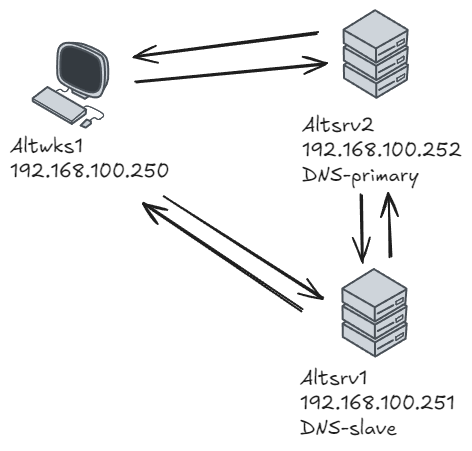
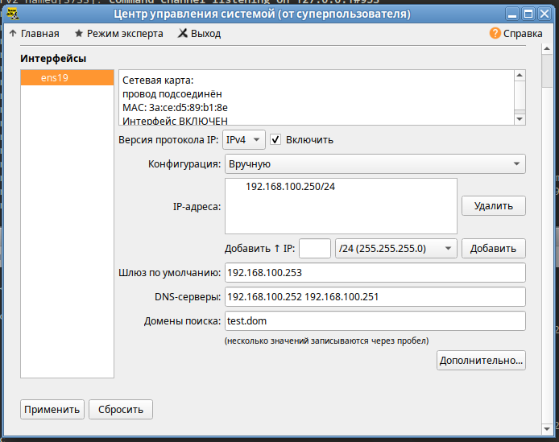

### Используемые ВМ
1. Клиентский узел - любая ВМ на выбор
2. Сервер DNS (primary) - любая ВМ на выбор
3. Сервер DNS (secondary)- любая ВМ на выбор
### Целевое состояние
* Функциональные требования
	* DNS-сервер с зоной test.dom (первичный по отношению к зоне) и зоной обратного просмотра, соответствующая IP-сети стенда
	* DNS-сервер, вторичный по отношению к обоим указанным зона
	* репликация обеих зон работает при обновлении зон на первичном сервере
	* клиентский узел настроенный на разрешение имен через оба DNS-сервера
* Требования безопасности
	* зонные трансферы возможны только между первичным и вторичным DNS-серверами, но не доступны с других узлов стенда
	* правила фильтрации трафика на обоих DNS-серверах разрешают прием запросов от клиентов и трафик репликации между серверами
	* правила фильтрации трафика позволяют выполнять обновление ПО на DNS-серверах
	* все остальные варианты сетевого взаимодействия с DNS-серверами блокируются
### Методика проверки
* Проверка подключений с клиентского узла или любого другого узла стенда, кроме DNS-серверов
	* есть возможность выполнить запрос к DNS-серверу
	* нет возможности запросить трансфер зоны
	* утилитой nmap к любому другому порту - порты протоколов, не указанных в требованиях безопасности не должны быть доступны
* Проверка возможности выполнить обновление ПО серверов DNS

### Altsrv2
```bash
apt-get install bind bind-utils
cd /var/lib/bind
touch zone/test.dom.zone
touch zone/192-168.100.zone
chown named:named zone/test.dom.zone
chown named:named zone/192-168.100.zone
vim zone/test.dom.zone
vim zone/192-168.100.zone
named-checkzone 100.168.192.in-addr.arpa zone/192-168.100.zone
named-checkzone test.dom zone/test.dom.zone
vim etc/local.conf
vim etc/options.conf
named-checkconf -p
```
#### /var/lib/bind/zone/test.dom.zone
``` linenums="1"
$TTL 2h
@       IN      SOA     test.dom        root.test.dom. (
        2025032801
        12h
        2h
        2d
        2h )
        IN      NS      altsrv2
        IN      NS      altsrv1
altsrv2 IN      A       192.168.100.252
altwks1 IN      A       192.168.100.250
altsrv1 IN      A       192.168.100.251
@       IN      A       192.168.100.252
```
#### /var/lib/bind/zone/192-168.100.zone
``` linenums="1"
$TTL 2h
100.168.192.in-addr.arpa.	IN	SOA altsrv2.test.dom.	root.test.dom. (
	2025032801
	10800
	1800
	3600000
	259200 )
	IN	NS	altsrv2.test.dom.
252	IN	PTR	altsrv2.test.dom.
250	IN	PTR	altwks1.test.dom.
251	IN	PTR	altsrv1.test.dom.
```
#### etc/local.conf
``` linenums="1"
include "/etc/bind/rfc1912.conf";

// Consider adding the 1918 zones here,
// if they are not used in your organization.
//      include "/etc/bind/rfc1918.conf";

// Add other zones here
zone "test.dom" {
        type master;
        file "test.dom.zone";
};

zone "100.168.192.in-addr.arpa" {
        type master;
        file "192-168.100.zone";
};
```
#### /var/lib/bind/etc/options.conf
``` linenums="1"
acl goodhosts {
	localnets;
	localhost;
	192.168.100.0/24;
	};
options {
	version "unknown";
	directory "/etc/bind/zone";
	dump-file "/var/run/named/named_dump.db";
	statistics-file "/var/run/named/named.stats";
	recursing-file "/var/run/named/named.recursing";
	secroots-file "/var/run/named/named.secroots";

	// disables the use of a PID file
	pid-file none;

	/*
	 * Oftenly used directives are listed below.
	 */

	listen-on { localhost; 192.168.100.252; };
	listen-on-v6 { ::1; };

	/*
	 * If the forward directive is set to "only", the server will only
	 * query the forwarders.
	 */
	forward only;
	forwarders { 77.88.8.8; };

	/*
	 * Specifies which hosts are allowed to ask ordinary questions.
	 */
	//allow-query { localnets; };

	/*
	 * This lets "allow-query" be used to specify the default zone access
	 * level rather than having to have every zone override the global
	 * value. "allow-query-cache" can be set at both the options and view
	 * levels.  If "allow-query-cache" is not set then "allow-recursion" is
	 * used if set, otherwise "allow-query" is used if set unless
	 * "recursion no;" is set in which case "none;" is used, otherwise the
	 * default (localhost; localnets;) is used.
	 */
	//allow-query-cache { localnets; };

	/*
	 * Specifies which hosts are allowed to make recursive queries
	 * through this server.  If not specified, the default is to allow
	 * recursive queries from all hosts.  Note that disallowing recursive
	 * queries for a host does not prevent the host from retrieving data
	 * that is already in the server's cache.
	 */
	allow-recursion { goodhosts; };

	/*
	 * Sets the maximum time for which the server will cache ordinary
	 * (positive) answers.  The default is one week (7 days).
	 */
	//max-cache-ttl 86400;

	/*
	 * The server will scan the network interface list every
	 * interface-interval minutes.  The default is 60 minutes.
	 * If set to 0, interface scanning will only occur when the
	 * configuration file is loaded.  After the scan, listeners will
	 * be started on any new interfaces (provided they are allowed by
	 * the listen-on configuration).  Listeners on interfaces that
	 * have gone away will be cleaned up.
	 */
	//interface-interval 0;
	allow-transfer { localhost; 192.168.100.251; };
};

logging {
	// The default_debug channel has the special property that it only
	// produces output when the server’s debug level is non-zero. It
	// normally writes to a file called named.run in the server’s working
	// directory.

	// For security reasons, when the -u command-line option is used, the
	// named.run file is created only after named has changed to the new
	// UID, and any debug output generated while named is starting - and
	// still running as root - is discarded. To capture this output, run
	// the server with the -L option to specify a default logfile, or the
	// -g option to log to standard error which can be redirected to a
	// file.

	// channel default_debug {
	// 	file "/var/log/named/named.run" versions 10 size 20m;
	// 	print-time yes;
	// 	print-category yes;
	// 	print-severity yes;
	// 	severity dynamic;
	// };
};
```
#### iptables
```bash linenums="1"
#!/bin/bash

# Очистка текущих правил и установка политик по умолчанию
iptables -F
iptables -X

# Разрешить все исходящие соединения
iptables -P OUTPUT ACCEPT

# Разрешаем локальный трафик (loopback)
iptables -A INPUT -i lo -j ACCEPT
iptables -A OUTPUT -o lo -j ACCEPT

# Разрешаем входящие DNS-запросы от клиентов (UDP 53)
iptables -A INPUT -p udp --dport 53 -j ACCEPT

# Разрешаем трафик репликации со вторичного DNS (192.168.100.251)
iptables -A INPUT -p tcp --dport 53 -s 192.168.100.251 -j ACCEPT

# Разрешаем обновление ПО (HTTP/HTTPS)
iptables -A INPUT -p tcp --dport 80 -j ACCEPT   # HTTP
iptables -A INPUT -p tcp --dport 443 -j ACCEPT  # HTTPS

# Разрешаем уже установленные соединения
iptables -A INPUT -m state --state ESTABLISHED,RELATED -j ACCEPT

# Запрещаем остальное
iptables -P INPUT DROP
```
### Altsrv1
```bash
apt-get install bind bind-utils
vim /var/lib/bind/etc/options.conf
cd /var/lib/bind
control bind-slave enabled
vim etc/local.conf
named-checkconf -p
rndc reload
dig @192.168.100.251 test.dom AXFR
```
#### /var/lib/bind/etc/options.conf
``` linenums="1"
acl goodhosts {
	localnets;
	localhost;
	192.168.100.0/24;
	};
options {
	version "unknown";
	directory "/etc/bind/zone";
	dump-file "/var/run/named/named_dump.db";
	statistics-file "/var/run/named/named.stats";
	recursing-file "/var/run/named/named.recursing";
	secroots-file "/var/run/named/named.secroots";

	// disables the use of a PID file
	pid-file none;

	/*
	 * Oftenly used directives are listed below.
	 */

	listen-on { localhost; 192.168.100.252; };
	listen-on-v6 { ::1; };

	/*
	 * If the forward directive is set to "only", the server will only
	 * query the forwarders.
	 */
	forward only;
	forwarders { 77.88.8.8; };

	/*
	 * Specifies which hosts are allowed to ask ordinary questions.
	 */
	//allow-query { localnets; };

	/*
	 * This lets "allow-query" be used to specify the default zone access
	 * level rather than having to have every zone override the global
	 * value. "allow-query-cache" can be set at both the options and view
	 * levels.  If "allow-query-cache" is not set then "allow-recursion" is
	 * used if set, otherwise "allow-query" is used if set unless
	 * "recursion no;" is set in which case "none;" is used, otherwise the
	 * default (localhost; localnets;) is used.
	 */
	//allow-query-cache { localnets; };

	/*
	 * Specifies which hosts are allowed to make recursive queries
	 * through this server.  If not specified, the default is to allow
	 * recursive queries from all hosts.  Note that disallowing recursive
	 * queries for a host does not prevent the host from retrieving data
	 * that is already in the server's cache.
	 */
	allow-recursion { goodhosts; };

	/*
	 * Sets the maximum time for which the server will cache ordinary
	 * (positive) answers.  The default is one week (7 days).
	 */
	//max-cache-ttl 86400;

	/*
	 * The server will scan the network interface list every
	 * interface-interval minutes.  The default is 60 minutes.
	 * If set to 0, interface scanning will only occur when the
	 * configuration file is loaded.  After the scan, listeners will
	 * be started on any new interfaces (provided they are allowed by
	 * the listen-on configuration).  Listeners on interfaces that
	 * have gone away will be cleaned up.
	 */
	//interface-interval 0;
	allow-transfer { localhost; };
};

logging {
	// The default_debug channel has the special property that it only
	// produces output when the server’s debug level is non-zero. It
	// normally writes to a file called named.run in the server’s working
	// directory.

	// For security reasons, when the -u command-line option is used, the
	// named.run file is created only after named has changed to the new
	// UID, and any debug output generated while named is starting - and
	// still running as root - is discarded. To capture this output, run
	// the server with the -L option to specify a default logfile, or the
	// -g option to log to standard error which can be redirected to a
	// file.

	// channel default_debug {
	// 	file "/var/log/named/named.run" versions 10 size 20m;
	// 	print-time yes;
	// 	print-category yes;
	// 	print-severity yes;
	// 	severity dynamic;
	// };
};
```
#### etc/local.conf
``` linenums="1"
include "/etc/bind/rfc1912.conf";

// Consider adding the 1918 zones here,
// if they are not used in your organization.
//      include "/etc/bind/rfc1918.conf";

// Add other zones here
zone "test.dom" {
        type slave;
        masters { 192.168.100.252; };
        file "slave/test.dom.zone";
};
zone "100.168.192.in-addr.arpa" {
        type slave;
	masters { 192.168.100.252; };
        file "slave/192-168.100.zone";
};

```
#### iptables
```bash linenums="1"
#!/bin/bash

# Очистка текущих правил и установка политик по умолчанию
iptables -F
iptables -X

# Разрешить все исходящие соединения
iptables -P OUTPUT ACCEPT

# Разрешаем локальный трафик (loopback)
iptables -A INPUT -i lo -j ACCEPT
iptables -A OUTPUT -o lo -j ACCEPT

# Разрешаем входящие DNS-запросы от клиентов (UDP 53)
iptables -A INPUT -p udp --dport 53 -j ACCEPT

# Разрешаем трафик репликации со вторичного DNS (192.168.100.252)
iptables -A INPUT -p tcp --dport 53 -s 192.168.100.252 -j ACCEPT

# Разрешаем обновление ПО (HTTP/HTTPS)
iptables -A INPUT -p tcp --dport 80 -j ACCEPT   # HTTP
iptables -A INPUT -p tcp --dport 443 -j ACCEPT  # HTTPS

# Разрешаем уже установленные соединения
iptables -A INPUT -m state --state ESTABLISHED,RELATED -j ACCEPT

# Запрещаем остальное
iptables -P INPUT DROP
```
### Altwks1

```
[sysadmin@altwks1 ~]$ cat /etc/resolv.conf
# Generated by resolvconf
# Do not edit manually, use
# /etc/net/ifaces/<interface>/resolv.conf instead.
search test.dom
nameserver 192.168.100.252
nameserver 192.168.100.251

[sysadmin@altwks1 ~]$ host -t NS test.dom
test.dom name server altsrv2.test.dom.
test.dom name server altsrv1.test.dom.

[sysadmin@altwks1 ~]$ host -t NS test.dom 192.168.100.251
Using domain server:
Name: 192.168.100.251
Address: 192.168.100.251#53
Aliases: 

test.dom name server altsrv1.test.dom.
test.dom name server altsrv2.test.dom.

apt-get install nmap
[root@altwks1 ~]# nmap -sS altsrv1
Starting Nmap 7.80 ( https://nmap.org ) at 2025-03-29 14:44 MSK
Nmap scan report for altsrv1 (192.168.100.251)
Host is up (0.00050s latency).
Not shown: 998 filtered ports
PORT    STATE  SERVICE
80/tcp  closed http
443/tcp closed https
MAC Address: FA:E1:C3:2C:2B:9A (Unknown)

Nmap done: 1 IP address (1 host up) scanned in 4.83 seconds

[root@altwks1 ~]# nmap -sU altsrv1
Starting Nmap 7.80 ( https://nmap.org ) at 2025-03-29 14:44 MSK
Nmap scan report for altsrv1 (192.168.100.251)
Host is up (0.00079s latency).
Not shown: 999 open|filtered ports
PORT   STATE SERVICE
53/udp open  domain
MAC Address: FA:E1:C3:2C:2B:9A (Unknown)

Nmap done: 1 IP address (1 host up) scanned in 18.55 sec
```
