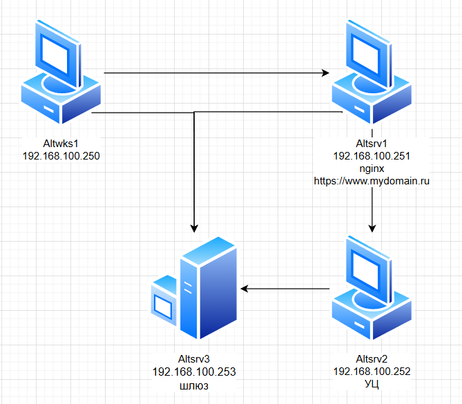

### Используемые ВМ
1. Клиентский узел - любая ВМ на выбор
2. Веб-сервер, удостоверяющий центр - две любые разные ВМ на ваш выбор
### Целевое состояние
* Функциональные требования
	* веб-сайт с адресом https://www.mydomain.ru
	* по меньшей мере с одной статической Web-страницей произвольного содержания
* Требования безопасности
	* web-сайт использует сертификат, выданный собственным удостоверяющем центром
	* сертификат удостоверяющего центра добавлен в базу сертификатов браузера клиентского узла
### Методика проверки
* Проверка подключений с клиентского узла и и любого другого узла стенда
	* браузером по указанному в функциональных требованиях адресу - сайт должен открываться, при этом соединение должно отображаться как защищенное
* Проверка возможности выполнить обновление ПО веб-сервера


### Altsrv2
```bash
echo "192.168.100.252 altsrv2" >> /etc/hosts
apt-get install easy-rsa
mkdir /srv/ca
cd /srv/ca
easyrsa init-pki
easyrsa build-ca
...
Enter New CA Key Passphrase: 123456778
Re-Enter New CA Key Passphrase: 12345678
...
Common Name (eg: your user, host, or server name) [Easy-RSA CA]:altsrv2
...
## вставляем содержимое на подпись
vim mydomain.ru.req
easyrsa import-req mydomain.ru.req mydomain.ru
cat /srv/ca/pki/issued/mydomain.ru.crt ## копируем и вставляем на altsrv1
cat pki/ca.crt ## копируем и вставляем на altsrv1
```

### Altsrv1
```bash
apt-get install nginx webserver-common easy-rsa
systemctl enable --now nginx
mkdir /srv/ca
cd /srv/ca
easyrsa init-pki
easyrsa gen-req mydomain.ru nopass
cat /srv/ca/pki/reqs/mydomain.ru.req ## скопировать и вставить на altsrv2
## вставляем mydomain.ru.crt из altsrv2
vim pki/mydomain.ru.crt
## вставляем ca.crt
vim pki/ca.crt

cd /etc/nginx/sites-available.d/
vim mydomain.conf
mkdir -p /var/www/vhosts/mydomain/{htdocs,logs}
echo "<html><body><h1><b>MYDOMAIN.RU<b></h1></body></html>" > /var/www/vhosts/mydomain/htdocs/index.html
cd /etc/nginx/sites-enabled.d/
ln -s ../sites-available.d/mydomain.conf ./
nginx -t
systemctl restart nginx
```
#### mydomain.conf
``` linenums="1"
server {
        listen 443 ssl;

        server_name mydomain.ru;
        ssl_certificate /srv/ca/pki/mydomain.ru.crt;
        ssl_certificate_key /srv/ca/pki/private/mydomain.ru.key;
        location / {
                root /var/www/vhosts/mydomain/htdocs;
        }
        access_log /var/www/vhosts/mydomain/logs/access.log;
        error_log /var/www/vhosts/mydomain/logs/error.log;
}
server {
        listen 80;
        server_name mydomain.ru;
        return 301 https://$server_name$request_uri;
}
```
### Altwks1
```bash
echo "192.168.100.251 mydomain.ru www.mydomain.ru" >> /etc/hosts
echo "192.168.100.252 altsrv2" >> /etc/hosts

# вставляем содержимое ca.crt в дом.папку пользователя sysadmin
vim ~/ca.crt
```