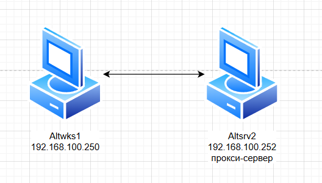

### Используемые ВМ
1. Клиентский узел - любая ВМ на выбор
2. Сервер (прокси SQUID) - либо на altsrv2 либо на astra2
### Целевое состояние
* Функциональные требования
	* на сервере - развернутый SQUID в непрозрачном режиме с использованием порта 3128 для обработки клиентских запросов
	* настроенная на SQUID аутентификация по методу BASIC или DIGEST
	* пользователи для аутентификации на прокси: proxyuser1 - пароль netlab123, proxyuser2 - пароль netlab123
	* настроенный на прокси браузер клиентского узла
* Требования безопасности
	* подключение к интернету возможно только при условии настройки клиентского приложения на работу через прокси и только при условии успешной аутентификации на прокси сервере
	* параметры фильтрации трафика на прокси-сервере обеспечивают возможность подключения к прокси-серверу с узлов сети стенда
	* параметры фильтрации трафика на прокси-сервере разрешают исходящий трафик для выполнения прокси-сервером запросов пользователей
	* параметры фильтрации трафика на прокси-сервере разрешают исходящий трафик для обновления ПО сервера
	* параметры фильтрации трафика запрещают любые другие варианты взаимодействий кроме указанных выше
### Методика проверки
* Проверка подключений с клиентского узла или любого другого узла стенда
	* проверка возможности доступа к интернету по протоколам HTTP/HTTPS при условии настройки браузера на proxy-сервер и корректного ввода данных аутентификации
	* проверка невозможности доступа к интернету без настройки на прокси сервер
	* проверка невозможности доступа к интернету при указании УЗ/паролей, отличных от: proxyuser1 - пароль netlab123, proxyuser2 - пароль netlab123
	* утилитой nmap - порты протоколов, не указанных в требованиях безопасности не должны быть доступны на прокси-сервере
* Проверка возможности выполнить обновление ПО прокси-сервера


### Altwks1
```bash
echo "192.168.100.252 altsrv2" >> /etc/hosts
apt-get install nmap
```
### Altsrv2
```bash
apt-get install squid squid-helpers
systemctl enable --now squid
vim /etc/squid/squid.conf
squid -k check
systemctl restart squid

## basic аутентификация
cd /etc/squid
touch passwd
chown squid:squid passwd
apt-get install apache2-htpasswd
htpasswd passwd proxyuser1 # пароль netlab123
htpasswd passwd proxyuser2 # пароль netlab123
```
#### /etc/squid/squid.conf
```
...

# auth_param (basic)
auth_param basic program /usr/lib/squid/basic_ncsa_auth /etc/squid/passwd
auth_param basic children 5
auth_param basic realm Squid Basic Authentication
auth_param basic credentialsttl 2 hours

#
# Recommended minimum Access Permission configuration:
#

...

#
# INSERT YOUR OWN RULE(S) HERE TO ALLOW ACCESS FROM YOUR CLIENTS
#

# For example, to allow access from your local networks, you may uncomment the
# following rule (and/or add rules that match your definition of "local"):
# http_access allow localnet
#
acl exam scr 192.168.100.0/24
acl auth_users proxy_auth REQUIRED
http_access allow auth_users
#http_access allow exam

...

#
# Cache settings
#
cache_mem 256 MB
cache_dir ufs /var/spool/squid/ 1000 16 16
```
#### iptables
```bash linenums="1"
#!/bin/bash

# Очистка существующих правил
iptables -F
iptables -X

# Разрешить все исходящие соединения
iptables -P OUTPUT ACCEPT

# Разрешить входящие соединения на локальный интерфейс
iptables -A INPUT -i lo -j ACCEPT
iptables -A OUTPUT -o lo -j ACCEPT

# Разрешаем DNS
iptables -A INPUT -p udp --dport 53 -j ACCEPT # для сервера

# Разрешение обновлений ПО сервера
iptables -A INPUT -p tcp --sport 80 -j ACCEPT
iptables -A INPUT -p tcp --sport 443 -j ACCEPT

# Разрешение коннекта клиентов
iptables -A INPUT -p tcp --dport 3128 -j ACCEPT

iptables -A INPUT -m state --state ESTABLISHED,RELATED -j ACCEPT

# Запрет остального
iptables -P INPUT DROP
```