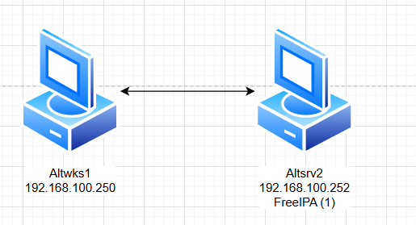

### Используемые ВМ
1. Клиентский узел - любая ВМ на выбор
2. Сервер FreeIPA - любая ВМ на выбор
### Целевое состояние
* Функциональные требования
	* домен FreeIPA с именем test.dom
	* в состав домена введены сервер и клиентский узел
	* с клиентского узла возможен вход в домен под доменными УЗ: ipauser1 - пароль `Pa$$word`, ipauser2 - пароль `Pa$$word`,
* Требования безопасности
	* параметры фильтрации трафика на сервере FreeIPA разрешают доступ к серверу по протоколам HTTPS, LDAP, SMB, Kerberos, NTP с узлов сети стенда
	* параметры фильтрации трафика на сервере FreeIPA разрешают исходящий трафик для обновления ПО сервера
	* параметры фильтрации трафика запрещают любые другие варианты взаимодействий кроме указанных
### Методика проверки
* Проверка подключений с клиентского узла
	* должна быть возможность входа в систему под произвольной учетной записью домена IPA
* Проверка подключений с клиентского узла или любого другого узла стенда
	* утилитой nmap к любому другому порту - порты протоколов, не указанных в требованиях безопасности не должны быть доступны
*  Проверка возможности выполнить обновление ПО сервера FreeIPA


### Altwks1
```bash
echo "192.168.100.250 altwks1.test.dom altwks1" >> /etc/hosts
echo "192.168.100.252 altsrv2.test.dom altsrv2" >> /etc/hosts
hostnamectl set-hostname altwks1.test.dom
reboot
apt-get install task-auth-freeipa
vim /etc/net/ifaces/ens19/resolv.conf
```
#### /etc/net/ifaces/ens19/resolv.conf
```
search test.dom
nameserver 192.168.100.252
```

### Altsrv2
```bash
echo "192.168.100.250 altwks1.test.dom altwks1" >> /etc/hosts
echo "192.168.100.252 altsrv2.test.dom altsrv2" >> /etc/hosts
hostnamectl set-hostname altsrv2.test.dom
reboot
apt-get install haveged
systemctl enable --now haveged

## отключение конфликтующих сервисов
service ahttpd stop
a2dissite 000-default_https
a2disport https
service httpd2 condreload

apt-get install freeipa-server freeipa-server-dns
ipa-server-install -U --hostname=$(hostname) -r TEST.DOM -n test.dom -p netlab123 -a netlab123 --setup-dns --no-forwarders --no-reverse
```

```
1. You must make sure these network ports are open:
		TCP Ports:
		  * 80, 443: HTTP/HTTPS
		  * 389, 636: LDAP/LDAPS
		  * 88, 464: kerberos
		  * 53: bind
		UDP Ports:
		  * 88, 464: kerberos
		  * 53: bind
		  * 123: ntp
```
#### iptables.sh
```bash linenums="1"
#!/bin/bash

# Очистка существующих правил
iptables -F
iptables -X

# Разрешить все исходящие соединения
iptables -P OUTPUT ACCEPT

# Разрешить входящие соединения на локальный интерфейс
iptables -A INPUT -i lo -j ACCEPT
iptables -A OUTPUT -o lo -j ACCEPT

# Разрешаем DNS
iptables -A INPUT -p udp --dport 53 -j ACCEPT # для сервера
iptables -A INPUT -p udp --sport 53 -j ACCEPT # для клиентов

# Разрешение обновлений ПО сервера
iptables -A INPUT -p tcp --sport 80 -j ACCEPT
iptables -A INPUT -p tcp --sport 443 -j ACCEPT

iptables -A INPUT -p tcp --dport 88 -j ACCEPT # Kerberos
iptables -A INPUT -p udp --dport 88 -j ACCEPT # Kerberos
iptables -A INPUT -p tcp --dport 389 -j ACCEPT # LDAP
iptables -A INPUT -p udp --dport 389 -j ACCEPT # LDAP
iptables -A INPUT -p tcp --dport 636 -j ACCEPT # LDAPS
iptables -A INPUT -p udp --dport 123 -j ACCEPT # NTP
iptables -A INPUT -p tcp --dport 445 -j ACCEPT # SMB

# Запретить все остальные входящие соединения
iptables -P INPUT DROP
```