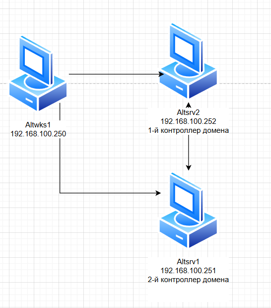
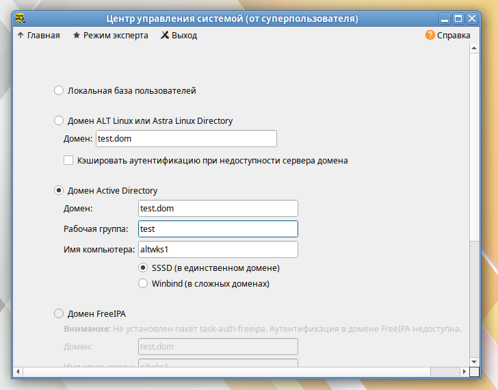

### Используемые ВМ
1. Клиентский узел - любая ВМ на выбор
2. Контроллер домена AD - любая ВМ на выбор
3. Второй контроллер домена AD - любая ВМ на выбор
### Целевое состояние
* Функциональные требования
	* домен Active Directory с именем test.dom
	* развернут резервный контроллер домена
	* в состав домена введен клиентский узел
	* с клиентского узла возможен вход в домен под доменными УЗ: sambauser1 - пароль `Pa$$word`, sambauser2 - пароль `Pa$$word`,
* Требования безопасности
	* с клиентского узла в составе домена под доменными УЗ возможен вход в систему
	* в случае если оба контроллера домена включены
	* в случае, если один из контроллеров домена (произвольный) выключен
### Методика проверки
* Проверка входа в систему клиентского узла под обоими доменными учетными записями
	* вход должен быть успешным в случае недоступности первого контроллера домена
	* вход должен быть успешным в случае недоступности второго контроллера домена


### Altsrv2
#### /etc/hosts
```
192.168.100.250 altwks1 altwks1.test.dom
192.168.100.251 altsrv1 altsrv1.test.dom
192.168.100.252 altsrv2 altsrv2.test.dom
```

```bash
hostnamectl set-hostname altsrv2.test.dom
apt-get install alterator-fbi
systemctl enable --now alteratord ahttpd
apt-get install alterator-net-domain task-samba-dc
apt-get install alterator-datetime ## через веб включить раздачу времени
systemctl restart alteratord ahttpd
systemctl stop smb nmb krb5kdc slapd bind dnsmasq
systemctl disable smb nmb krb5kdc slapd bind dnsmasq
rm -f /etc/samba/smb.conf
rm -rf /var/lib/samba
rm -rf /var/cache/samba
mkdir -p /var/lib/samba/sysvol
samba-tool domain provision --realm=test.dom --domain test --adminpass='Pa$$word' --dns-backend=SAMBA_INTERNAL --server-role=dc --use-rfc2307
systemctl enable --now samba
cp /var/lib/samba/private/krb5.conf /etc/krb5.conf
samba-tool dns add 127.0.0.1 test.dom altsrv1 A 192.168.100.251 -Uadministrator
samba-tool user create sambauser1
```
#### /etc/net/ifaces/ens19/resolv.conf
```
search test.dom
nameserver 127.0.0.1
```

### Altsrv1
#### /etc/hosts
```
192.168.100.250 altwks1 altwks1.test.dom
192.168.100.251 altsrv1 altsrv1.test.dom
192.168.100.252 altsrv2 altsrv2.test.dom
```
#### /etc/net/ifaces/ens19/resolv.conf
```
search test.dom
nameserver 192.168.100.252
```

```bash
hostnamectl set-hostname altsrv1.test.dom
apt-get install alterator-fbi
systemctl enable --now alteratord ahttpd
apt-get install alterator-net-domain task-samba-dc
apt-get install alterator-datetime
systemctl restart alteratord ahttpd
systemctl stop smb nmb krb5kdc slapd bind dnsmasq
systemctl disable smb nmb krb5kdc slapd bind dnsmasq
rm -f /etc/samba/smb.conf
rm -rf /var/lib/samba
rm -rf /var/cache/samba
mkdir -p /var/lib/samba/sysvol
vim /etc/krb5.conf ## вносим правки
samba-tool domain join test.dom DC -Uadministrator --realm=test.dom
systemctl enable samba

## проверка
host test.dom
samba-tool computer list
samba-tool user list

```
#### /etc/krb5.conf
```
[libdefaults]
 dns_lookup_kdc = true
 dns_lookup_realm = false
 ...
 default_realm = TEST.DOM
 ...
```

### Altwks1
#### /etc/hosts
```
192.168.100.250 altwks1 altwks1.test.dom
192.168.100.251 altsrv1 altsrv1.test.dom
192.168.100.252 altsrv2 altsrv2.test.dom
```
#### /etc/net/ifaces/ens19/resolv.conf
```
search test.dom
nameserver 192.168.100.252
```

```bash
hostnamectl set-hostname altswks1.test.dom
vim /etc/net/ifaces/ens19/resolv.conf
reboot

## ввод в домен
apt-get install task-auth-ad-sssd
```
