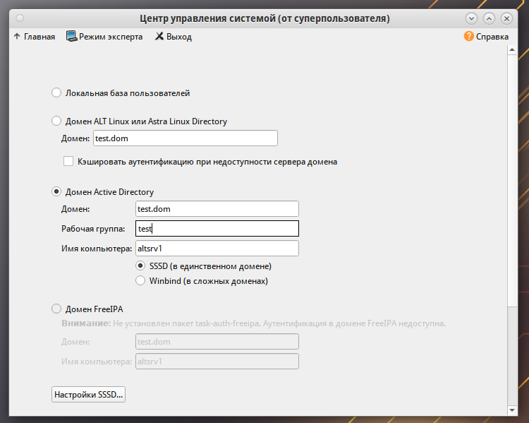
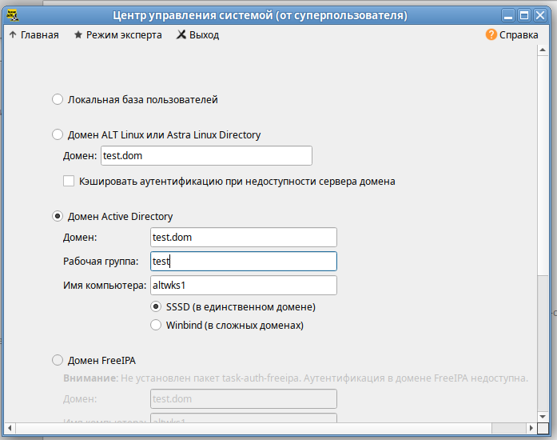

### Используемые ВМ
1. Клиентский узел - любая ВМ на выбор
2. Контроллер домена AD - любая ВМ на выбор
3. Сервер в составе домена - любая ВМ на выбор
### Целевое состояние
* Функциональные требования
	* домен Active Directory с именем test.dom
	* в состав домена введены сервер и клиентский узел
	* с клиентского узла возможен вход в домен под доменными УЗ: sambauser1 - пароль `Pa$$word`, sambauser2 - пароль `Pa$$word`,
* Требования безопасности
	* параметры фильтрации трафика на контроллере домена разрешают доступ к контроллеру домена по протоколам SSH, DNS, LDAP, SMB, Kerberos, NTP с узлов сети стенда
	* параметры фильтрации трафика на контроллере домена разрешают исходящий трафик для обновления ПО сервера
	* параметры фильтрации трафика запрещают любые другие варианты взаимодействий кроме указанных
### Методика проверки
* Проверка подключений с клиентского узла
	* должна быть возможность входа в систему под произвольной доменной учетной записью
* Проверка подключений с клиентского узла или любого другого узла стенда
	* утилитой nmap к любому другому порту - порты протоколов, не указанных в требованиях безопасности не должны быть доступны
* Проверка возможности выполнить обновление ПО контроллера домена


### Altsrv2
#### /etc/hosts
```
192.168.100.250 altwks1 altwks1.test.dom
192.168.100.251 altsrv1 altsrv1.test.dom
192.168.100.252 altsrv2 altsrv2.test.dom
```

```bash
hostnamectl set-hostname altsrv2.test.dom
apt-get install alterator-fbi
systemctl enable --now alteratord ahttpd
apt-get install alterator-net-domain task-samba-dc
apt-get install alterator-datetime ## через веб включить раздачу времени
systemctl restart alteratord ahttpd
systemctl stop smb nmb krb5kdc slapd bind dnsmasq
systemctl disable smb nmb krb5kdc slapd bind dnsmasq
rm -f /etc/samba/smb.conf
rm -rf /var/lib/samba
rm -rf /var/cache/samba
mkdir -p /var/lib/samba/sysvol
samba-tool domain provision --realm=test.dom --domain test --adminpass='Pa$$word' --dns-backend=SAMBA_INTERNAL --server-role=dc --use-rfc2307
systemctl enable --now samba
cp /var/lib/samba/private/krb5.conf /etc/krb5.conf
samba-tool user create sambauser1
samba-tool user create sambauser2
```
#### /etc/net/ifaces/ens19/resolv.conf
```
search test.dom
nameserver 127.0.0.1
```
#### iptables
```bash linenums="1"
#!/bin/bash

# Очистка существующих правил
iptables -F
iptables -X

# Разрешить все исходящие соединения
iptables -P OUTPUT ACCEPT

# Разрешить входящие соединения на локальный интерфейс
iptables -A INPUT -i lo -j ACCEPT
iptables -A OUTPUT -o lo -j ACCEPT

# Разрешаем DNS
iptables -A INPUT -p udp --dport 53 -j ACCEPT # для сервера
iptables -A INPUT -p udp --sport 53 -j ACCEPT # для клиентов

# Разрешение обновлений ПО сервера
iptables -A INPUT -p tcp --sport 80 -j ACCEPT
iptables -A INPUT -p tcp --sport 443 -j ACCEPT

iptables -A INPUT -p tcp --dport 22 -j ACCEPT # SSH
iptables -A INPUT -p tcp --dport 88 -j ACCEPT # Kerberos
iptables -A INPUT -p udp --dport 88 -j ACCEPT # Kerberos
iptables -A INPUT -p tcp --dport 389 -j ACCEPT # LDAP
iptables -A INPUT -p udp --dport 389 -j ACCEPT # LDAP
iptables -A INPUT -p tcp --dport 636 -j ACCEPT # LDAPS
iptables -A INPUT -p udp --dport 123 -j ACCEPT # NTP
iptables -A INPUT -p tcp --dport 445 -j ACCEPT # SMB

# Запретить все остальные входящие соединения
iptables -P INPUT DROP
```

```bash
iptables-save > /etc/sysconfig/iptables
iptables-restore /etc/sysconfig/iptables
systemctl enable --now iptables
```

### Altsrv1
#### /etc/hosts
```
192.168.100.250 altwks1 altwks1.test.dom
192.168.100.251 altsrv1 altsrv1.test.dom
192.168.100.252 altsrv2 altsrv2.test.dom
```

```bash
hostnamectl set-hostname altsrv1.test.dom
vim /etc/net/ifaces/ens19/resolv.conf
reboot

## ввод в домен
apt-get install task-auth-ad-sssd
```

#### /etc/net/ifaces/ens19/resolv.conf
```
search test.dom
nameserver 192.168.100.252
```

### Altwks1
#### /etc/hosts
```
192.168.100.250 altwks1 altwks1.test.dom
192.168.100.251 altsrv1 altsrv1.test.dom
192.168.100.252 altsrv2 altsrv2.test.dom
```

```bash
hostnamectl set-hostname altwks1.test.dom
vim /etc/net/ifaces/ens19/resolv.conf
reboot

## ввод в домен
apt-get install task-auth-ad-sssd
```

#### /etc/net/ifaces/ens19/resolv.conf
```
search test.dom
nameserver 192.168.100.252
```
