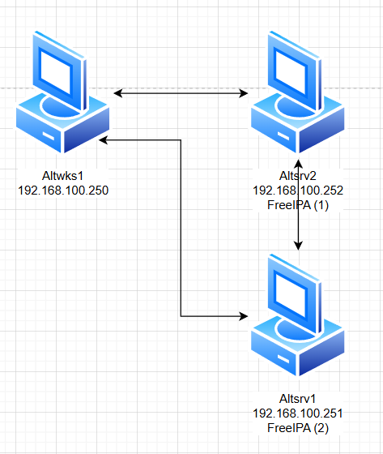

### Используемые ВМ
1. Клиентский узел - любая ВМ на выбор
2. Первый сервер FreeIPA - любая ВМ на выбор
3. Второй сервер FreeIPA - любая ВМ на выбор
### Целевое состояние
* Функциональные требования
	* домен FreeIPA с именем test.dom
	* развернут резервный сервер FreeIPA
	* в состав домена введен клиентский узел
	* с клиентского узла возможен вход в домен под доменными УЗ: ipaauser1 - пароль `Pa$$word`, ipauser2 - пароль `Pa$$word`,
* Требования безопасности
	* с клиентского узла в составе домена под доменными УЗ возможен вход в систему
	* в случае если оба сервера FreeIPA включены
	* в случае, если один из серверов FreeIPA (произвольный) выключен
### Методика проверки
* Проверка входа в систему клиентского узла под обоими доменными учетными записями
	* вход должен быть успешным в случае недоступности первого сервера FreeIPA
	* вход должен быть успешным в случае недоступности второго сервера FreeIPA


### Altwks1
```bash
echo "192.168.100.250 altwks1.test.dom altwks1" >> /etc/hosts
echo "192.168.100.251 altsrv1.test.dom altsrv1" >> /etc/hosts
echo "192.168.100.252 altsrv2.test.dom altsrv2" >> /etc/hosts
hostnamectl set-hostname altwks1.test.dom
reboot
apt-get install task-auth-freeipa
vim /etc/net/ifaces/ens19/resolv.conf
```
#### /etc/net/ifaces/ens19/resolv.conf
```
search test.dom
nameserver 192.168.100.252
```
### Altsrv2
```bash
echo "192.168.100.250 altwks1.test.dom altwks1" >> /etc/hosts
echo "192.168.100.251 altsrv1.test.dom altsrv1" >> /etc/hosts
echo "192.168.100.252 altsrv2.test.dom altsrv2" >> /etc/hosts
hostnamectl set-hostname altsrv2.test.dom
reboot
apt-get update
apt-get install haveged
systemctl enable --now haveged

## отключение конфликтующих сервисов
service ahttpd stop
a2dissite 000-default_https
a2disport https
service httpd2 condreload

apt-get install freeipa-server freeipa-server-dns
ipa-server-install -U --hostname=$(hostname) -r TEST.DOM -n test.dom -p netlab123 -a netlab123 --setup-dns --no-forwarders --no-reverse
ipa dnsrecord-add test.dom _ntp._udp --srv-priority=0 --srv-weight=100 --srv-port=123 --srv-target=altsrv2.test.dom.
```

```
1. You must make sure these network ports are open:
		TCP Ports:
		  * 80, 443: HTTP/HTTPS
		  * 389, 636: LDAP/LDAPS
		  * 88, 464: kerberos
		  * 53: bind
		UDP Ports:
		  * 88, 464: kerberos
		  * 53: bind
		  * 123: ntp
```
### Altsrv1
```bash
echo "192.168.100.250 altwks1.test.dom altwks1" >> /etc/hosts
echo "192.168.100.251 altsrv1.test.dom altsrv1" >> /etc/hosts
echo "192.168.100.252 altsrv2.test.dom altsrv2" >> /etc/hosts
hostnamectl set-hostname altsrv1.test.dom
reboot
apt-get update
apt-get install haveged
systemctl enable --now haveged
vim /etc/net/ifaces/ens19/resolv.conf
apt-get install freeipa-client freeipa-server-dns

## отключение конфликтующих сервисов
service ahttpd stop
a2dissite 000-default_https
a2disport https
service httpd2 condreload

ipa-client-install -d --domain=test.dom --server=altsrv2.test.dom --realm=TEST.DOM --principal=admin --password=netlab123 --enable-dns-updates -U
ipa-replica-install
ipa-dns-install
ipa-ca-install
```
#### /etc/net/ifaces/ens19/resolv.conf
```
search test.dom
nameserver 192.168.100.252
```
